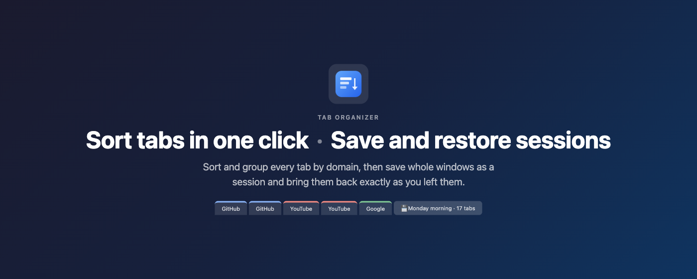
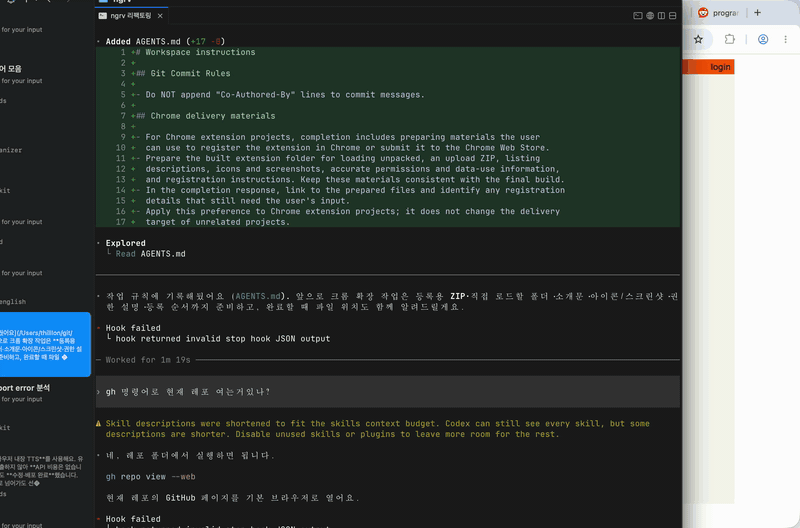
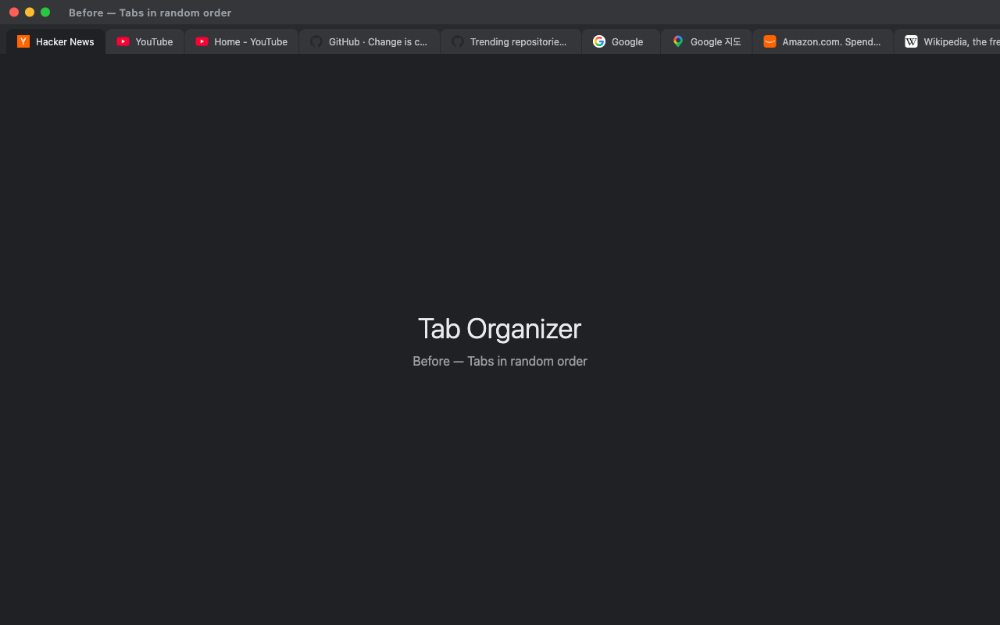
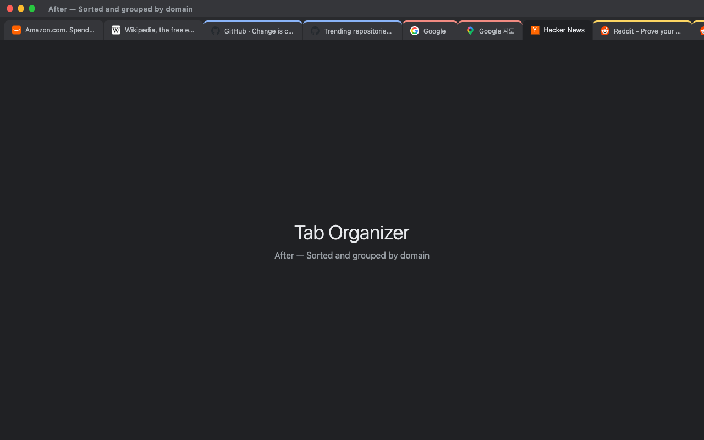
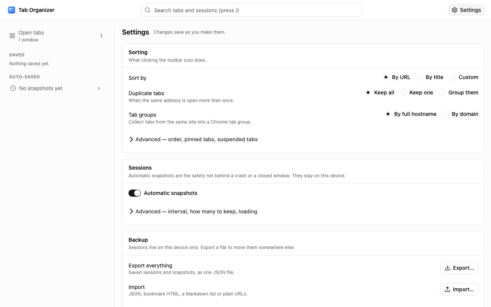

<p align="center">
  <a href="https://chromewebstore.google.com/detail/tab-organizer/bmbpmnfhfbdjdjpblimidmbohgccmjdg">
    
  </a>
</p>

<h1 align="center">Tab Organizer</h1>

<p align="center">
  <strong>One click. Every tab sorted, grouped, and de-duplicated — plus sessions you can save and restore.</strong><br />
  No popup, no account, no data ever leaves your browser.
</p>

<p align="center">
  <a href="https://chromewebstore.google.com/detail/tab-organizer/bmbpmnfhfbdjdjpblimidmbohgccmjdg"></a>
  <a href="https://chromewebstore.google.com/detail/tab-organizer/bmbpmnfhfbdjdjpblimidmbohgccmjdg"></a>
  <a href="https://chromewebstore.google.com/detail/tab-organizer/bmbpmnfhfbdjdjpblimidmbohgccmjdg"></a>
  <a href="https://github.com/thilllon/tab-organizer/releases"></a>
  <a href="https://github.com/thilllon/tab-organizer/actions/workflows/ci.yml"></a>
</p>

<p align="center">
  <a href="https://chromewebstore.google.com/detail/tab-organizer/bmbpmnfhfbdjdjpblimidmbohgccmjdg"><strong>➜ Install from the Chrome Web Store</strong></a>
</p>

## See it in action

Pin the icon, click it, done — every tab in the window is sorted and grouped by site:

<p align="center">
  
</p>

<table>
  <tr>
    <th width="50%">Before</th>
    <th width="50%">After</th>
  </tr>
  <tr>
    <td></td>
    <td></td>
  </tr>
</table>

## Features

|                               |                                                                                                                                                                                                                                                    |
| ----------------------------- | -------------------------------------------------------------------------------------------------------------------------------------------------------------------------------------------------------------------------------------------------- |
| **▸ One-click sorting**       | Click the toolbar icon. No menus, no dialogs — the current window is organized instantly.                                                                                                                                                          |
| **▸ Three sort modes**        | By URL, by title, or custom grouping that keeps sites in the order you first opened them.                                                                                                                                                          |
| **▸ Smart grouping**          | Group by full hostname (`mail.google.com` ≠ `drive.google.com`) or by domain (all of Google together, `.co.uk`-style TLDs handled).                                                                                                                |
| **▸ Native tab groups**       | Existing Chrome tab groups are sorted by name (prefix with `1-`, `2-` to pin an order) and tidied inside.                                                                                                                                          |
| **▸ Duplicate detection**     | Leave duplicates alone, close all but one, or collect them into a labeled group to review first.                                                                                                                                                   |
| **▸ Pinned & suspended tabs** | Pinned tabs stay put unless you say otherwise; tabs suspended by The Marvellous Suspender sort by their real URL.                                                                                                                                  |
| **▸ Sessions**                | Right-click the icon → save this window or all windows; the full-page Sessions dashboard restores them exactly (order, pinned, groups, active tab). Automatic local snapshots every 5 min for crash recovery, off in one click (coming in v7.0.0). |

## Settings

Right-click the icon → **Options** to choose the grouping level and how duplicates are handled.

<p align="center">
  
</p>

## Privacy

- **Zero network requests** — works entirely offline, no analytics, no telemetry.
- **Permissions** — `tabs`, `tabGroups`, `storage` (settings via Chrome sync; sessions in local storage on this device only), `contextMenus` (icon menu), `unlimitedStorage` (large sessions), `favicon` (site icons from Chrome's local cache). Automatic snapshots (coming in v7.0.0) use `alarms` and can be turned off.
- **No content scripts** — nothing is ever injected into a web page.
- Full policy: [PRIVACY_POLICY.md](PRIVACY_POLICY.md).

Everything shown on the store page — the complete description, every asset, the privacy answers — is kept in [`docs/README.md`](docs/README.md); `docs/description.txt` is generated from it.

## Development

### Setup

```shell
pnpm install
pnpm dev
```

### Load in Chrome

1. Open `chrome://extensions`
2. Enable **Developer mode**
3. Click **Load unpacked** and select the `dist` folder

### Scripts

```shell
pnpm dev                    # Start Vite dev server (port 5173)
pnpm build                  # Vite build -> dist/ (no type check; run typecheck separately)
pnpm typecheck              # Type check only (tsc --noEmit)
pnpm format                 # Biome check --write + Prettier (md/mdx/yml/yaml) + mise format (ruff)
pnpm test                   # Run tests (vitest)
pnpm listing                # Regenerate docs/description.txt (Chrome Web Store text) from docs/README.md
pnpm release                # release-it: regenerate CWS assets, bump version, build, ZIP, GitHub release
```

The `dist` folder will contain the production-ready extension.
