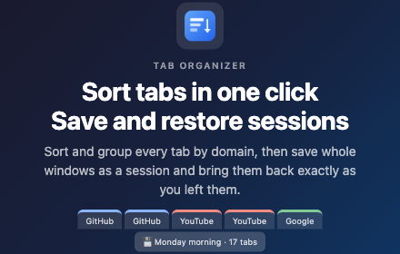

# Tab Organizer — Chrome Web Store Listing

> **This file is the single source of truth for the [Chrome Web Store listing](https://chromewebstore.google.com/detail/tab-organizer/bmbpmnfhfbdjdjpblimidmbohgccmjdg).**
> Everything shown on the store page — text, images, video, privacy disclosures — is kept here so the store and GitHub never drift apart.
> The store's Description field only accepts plain text, so `docs/description.txt` is **generated** from the [Description](#description) section below by `pnpm listing` (runs automatically on every commit and during `pnpm release`). Never edit `description.txt` by hand.

## Store listing

### Product details

| Field       | Value                                                        | Where it comes from                                                        |
| ----------- | ------------------------------------------------------------ | -------------------------------------------------------------------------- |
| Title       | Tab Organizer                                                | `package.json` `displayName` → manifest `name`                             |
| Summary     | Chrome extension that sorts and organizes your browser tabs. | `package.json` `description` → manifest `description` (max 132 characters) |
| Category    | Extensions › Functionality & UI                              | Developer Dashboard                                                        |
| Language    | English                                                      | Developer Dashboard                                                        |
| Description | See below → `docs/description.txt`                           | Generated by `pnpm listing`                                                |

### Description

Tab Organizer — One-Click Tab Sorting & Grouping for Chrome

Tired of dozens of messy, unorganized tabs cluttering your browser? Tab Organizer instantly sorts and groups all your tabs with a single click. No complicated setup, no account required, no data ever leaves your browser.

Just pin the extension icon to your toolbar and click it. That's it. Your tabs are instantly organized.

#### How it works

Click the Tab Organizer icon in your toolbar. Every tab in your current window is immediately sorted and organized. There's no popup, no extra steps — one click and you're done.

Tab Organizer handles three types of tabs independently:

- Pinned tabs (optionally sorted)
- Tab groups (sorted by group name, then tabs within each group are sorted)
- Ungrouped tabs (sorted and optionally grouped by website)

After sorting, duplicate tabs are handled according to your preference.

#### Features

##### One-Click Sorting

Click the extension icon to instantly sort all tabs in your current window. No menus, no dialogs — just instant organization.

##### Multiple Sort Modes

Choose how your tabs are sorted:

- By URL — Sorts tabs alphabetically by their web address. Tabs from the same website are grouped together naturally.
- By Title — Sorts tabs alphabetically by their page title.
- Custom Grouping — Groups tabs by website (hostname or domain), preserving the order in which you first visited each site.

##### Smart Tab Grouping

When using Custom Grouping mode, tabs are grouped by website. You can choose between two grouping levels:

- Subdomain mode — mail.google.com, drive.google.com, and docs.google.com are treated as separate groups.
- Domain mode — All Google services are merged into a single google.com group. This also handles special two-part TLDs like .co.uk, .com.au, and .ac.kr correctly.

##### Tab Group Support

Tab Organizer fully supports Chrome's native tab groups. It sorts your existing tab groups alphabetically by their group name, then sorts the tabs within each group. You can prefix group names with numbers (e.g., "1-Work", "2-Personal") to set a custom order.

##### Duplicate Tab Detection

How many times have you opened the same page in multiple tabs? Tab Organizer can help:

- Do nothing — Leave duplicates as they are.
- Close duplicates — Automatically close all duplicate tabs, keeping only the active one (or the first one).
- Group duplicates — Move duplicate tabs into a labeled Chrome tab group so you can review them before closing.

##### Pinned Tab Sorting

By default, pinned tabs are left in their original order. If you prefer, you can enable pinned tab sorting in the settings to include them in the sort.

##### Suspended Tab Support

If you use "The Marvellous Suspender" extension to save memory, Tab Organizer can detect suspended tabs and either:

- Sort them by their original URL (treating them like normal tabs)
- Group all suspended tabs together at the beginning for easy identification

##### Grouping Direction

When using Custom Grouping, you can choose the grouping direction:

- Left to Right — Groups are ordered by the first tab you opened from each website (natural browsing order).
- Right to Left — Groups are ordered in reverse, starting from the most recently opened websites.

##### Preserve Order Within Groups

In Custom Grouping mode, you can optionally preserve the original tab order within each group. This is useful if the order you opened tabs matters (e.g., reading articles in sequence).

#### Settings

Right-click the Tab Organizer icon and select "Options" to configure:

- Tab Grouping Mode
  - Subdomain: Groups tabs by full hostname (e.g., mail.google.com ≠ drive.google.com)
  - Domain: Groups tabs by base domain (e.g., all \*.google.com tabs together)
- Duplicate Tab Handling
  - Do nothing: Leave duplicate tabs as they are
  - Keep one, close the rest: Automatically close duplicates
  - Group into tab group: Collect duplicates into a labeled group for review

#### Privacy & Security

Tab Organizer is designed with privacy as a core principle:

- Zero data collection — No analytics, no tracking, no telemetry.
- Zero network requests — The extension never makes any HTTP requests. It works entirely offline.
- Minimal permissions — Only requests the three permissions it absolutely needs:
  - "tabs" — To read tab URLs and titles for sorting
  - "tabGroups" — To create and manage Chrome tab groups
  - "storage" — To save your preferences using Chrome's built-in sync storage
- No content scripts — Tab Organizer never injects code into any web page.
- No background network activity — The service worker only activates when you click the icon.
- Open and transparent — The extension does exactly what it says, nothing more.

Your browsing data stays on your device. Always.

#### Use cases

- Research sessions — You've opened 30+ tabs across Google Scholar, Wikipedia, and various journals. One click groups them by source.
- Work vs. personal — After a long day of mixed browsing, quickly group work tabs (Slack, Jira, GitHub) separately from personal tabs (YouTube, Reddit, news).
- Shopping comparison — You've got 15 product tabs open across Amazon, eBay, and other stores. Sort them to compare by site.
- Duplicate cleanup — You keep opening the same Stack Overflow answer in new tabs. Let Tab Organizer find and close the duplicates.
- Tab group maintenance — You already use Chrome tab groups but they've gotten disorganized. Tab Organizer sorts groups alphabetically and organizes tabs within each group.

#### FAQ

Q: Does Tab Organizer work across multiple windows?\
A: Tab Organizer sorts tabs in the currently focused window. Click the icon in each window you want to organize.

Q: Will it mess up my pinned tabs?\
A: No. Pinned tabs are left untouched by default. You can optionally enable pinned tab sorting in settings.

Q: Does it work with Chrome tab groups?\
A: Yes! It sorts your tab groups by name and organizes tabs within each group.

Q: Does it send my browsing data anywhere?\
A: Absolutely not. Tab Organizer makes zero network requests. Everything happens locally in your browser.

Q: What happens if I don't like the result?\
A: Use Ctrl+Z (Cmd+Z on Mac) immediately after sorting to undo tab moves in Chrome. Note that closed duplicate tabs cannot be recovered this way — use Chrome's "Recently closed" menu (Ctrl+Shift+T) to restore them.

Q: Does it support other Chromium browsers?\
A: Tab Organizer should work on any Chromium-based browser that supports Manifest V3 and the Tab Groups API, including Microsoft Edge and Brave.

#### Tips

- Pin the extension icon to your toolbar for quick access.
- Prefix your Chrome tab group names with numbers (e.g., "1-Priority", "2-Reference") to control their sort order.
- Use Domain grouping mode if you use many Google or Microsoft services — it keeps all their subdomains together.
- Use Subdomain grouping mode if you want more granular separation between services on the same domain.
- Try the "Group duplicates" option first before "Close duplicates" — it lets you review which tabs will be affected before you close them.

#### Support

If you encounter any issues or have feature requests, please file an issue on our GitHub repository (https://github.com/thilllon/tab-organizer/issues). We read every report and appreciate your feedback.

### Graphic assets

All images are generated by `pnpm release` (`scripts/prepare-registration.ts`) into `screenshots/`. Upload them in the order listed.

#### Store icon (128 × 128)

`public/img/logo-128.png` — also used as the manifest icon.

#### Screenshots (1280 × 800, up to 5)

1. `screenshots/before-sort.png` — tabs in random order

   

2. `screenshots/after-sort.png` — sorted and grouped by domain

   

3. `screenshots/screenshot-1280x800.png` — options page

   

A 640 × 400 variant of the options page (`screenshots/screenshot-640x400.png`) and native macOS captures (`screenshots/before-sort-native.png`, `screenshots/after-sort-native.png`) are kept as alternates.

#### Small promo tile (440 × 280)

`screenshots/promo-small-440x280.png`

#### Marquee promo tile (1400 × 560)

`screenshots/promo-marquee-1400x560.png`

#### Promo video

The store only accepts a **YouTube URL** for the promo video; none is published yet. The demo recording lives in the repo:

- `screenshots/demo.mp4` — [download / play](../screenshots/demo.mp4)
- `screenshots/demo.gif` — preview generated from the video

### Additional fields

| Field          | Value                                            |
| -------------- | ------------------------------------------------ |
| Homepage URL   | https://github.com/thilllon/tab-organizer        |
| Support URL    | https://github.com/thilllon/tab-organizer/issues |
| Mature content | No                                               |

## Privacy

### Single purpose

Sort and organize browser tabs by URL, title, or domain, and optionally group or remove duplicate tabs in the current window.

### Permission justifications

| Permission  | Justification                                                                                                                                                                                                                                                        |
| ----------- | -------------------------------------------------------------------------------------------------------------------------------------------------------------------------------------------------------------------------------------------------------------------- |
| `tabs`      | Required to read tab URLs and titles in the current window for sorting. The extension uses `chrome.tabs.query()` to retrieve tab information and `chrome.tabs.move()` to reorder them. No tab data is stored or transmitted externally.                              |
| `tabGroups` | Required to sort existing tab groups by title and to group duplicate tabs when the user enables that option. The extension uses `chrome.tabGroups.query()`, `chrome.tabGroups.move()`, and `chrome.tabGroups.update()` to organize groups within the current window. |
| `storage`   | Required to persist user preferences (sort method, grouping mode, duplicate handling) across sessions using `chrome.storage.sync`. No personal or browsing data is stored — only the extension's settings.                                                           |

Host permissions: none. Remote code: not used.

### Data usage

The extension does **not** collect or transmit any user data. All three certifications apply:

- Does not sell user data to third parties.
- Does not use or transfer user data for purposes unrelated to the item's core functionality.
- Does not use or transfer user data to determine creditworthiness or for lending purposes.

### Privacy policy URL

https://github.com/thilllon/tab-organizer/blob/main/PRIVACY_POLICY.md — the full text is [PRIVACY_POLICY.md](../PRIVACY_POLICY.md) in this repository.

## Distribution

| Field      | Value       |
| ---------- | ----------- |
| Visibility | Public      |
| Regions    | All regions |
| Pricing    | Free        |

## Updating the store listing

1. Edit this file. Keep the [Description](#description) section within the store's plain-text conventions: `####` headings become UPPER-CASE section titles, `#####` headings become `▸` feature titles, list items become `•` bullets, links become `text (url)`.
2. Commit — the pre-commit hook runs `pnpm listing`, which regenerates `docs/description.txt` (CI verifies it is up to date). Run `pnpm listing` manually to preview.
3. Run `pnpm release` to regenerate every image, the demo video/GIF and `description.txt`, bump the version and build the ZIP.
4. In the [Developer Dashboard](https://chrome.google.com/webstore/devconsole): upload the ZIP from `package/`, paste `docs/description.txt` into **Description**, upload the assets listed above, and copy the [Privacy](#privacy) answers.
5. Submit for review.
