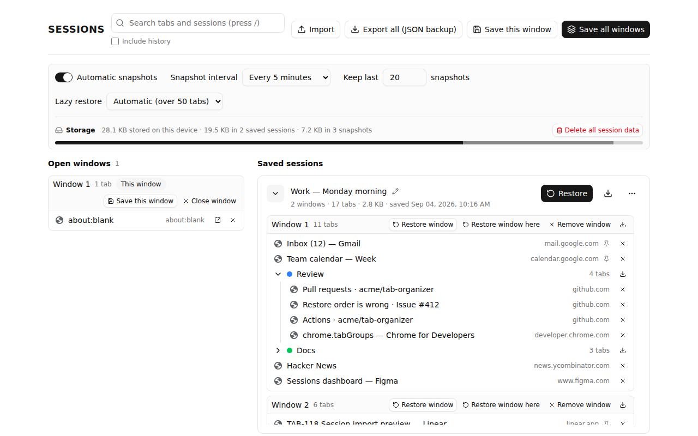
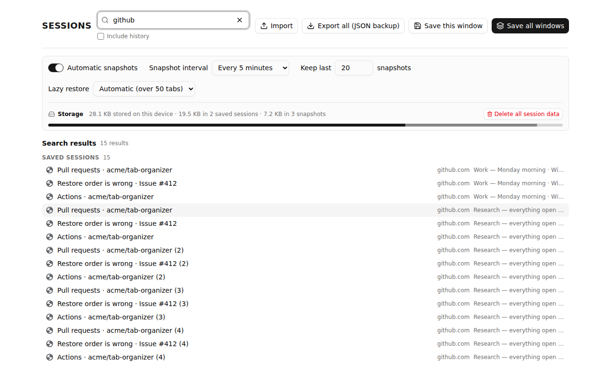
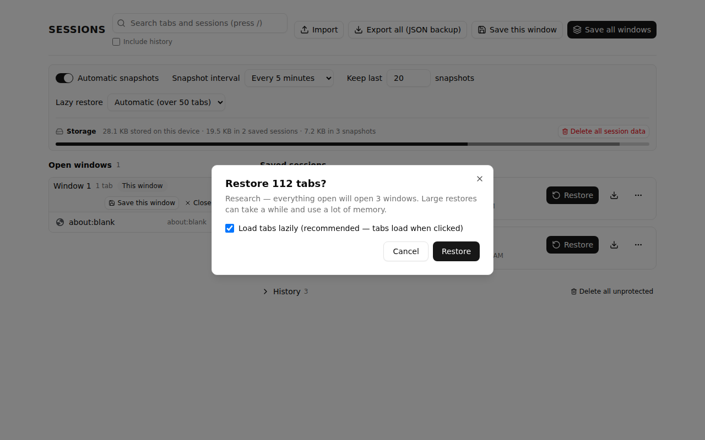

# Tab Organizer — Chrome Web Store Listing

> **This file is the single source of truth for the [Chrome Web Store listing](https://chromewebstore.google.com/detail/tab-organizer/bmbpmnfhfbdjdjpblimidmbohgccmjdg).**
> Everything shown on the store page — text, images, video, privacy disclosures — is kept here so the store and GitHub never drift apart.
> The store's Description field only accepts plain text, so `docs/description.txt` is **generated** from the [Description](#description) section below by `pnpm listing` (runs automatically on every commit and during `pnpm release`). Never edit `description.txt` by hand.

## Store listing

### Product details

| Field       | Value                                                                                                                              | Where it comes from                                                        |
| ----------- | ---------------------------------------------------------------------------------------------------------------------------------- | -------------------------------------------------------------------------- |
| Title       | Tab Organizer                                                                                                                      | `package.json` `displayName` → manifest `name`                             |
| Summary     | Sort and group every tab in one click, then save and restore whole windows as sessions. Offline, no account, stays on your device. | `package.json` `description` → manifest `description` (max 132 characters) |
| Category    | Extensions › Functionality & UI                                                                                                    | Developer Dashboard                                                        |
| Language    | English                                                                                                                            | Developer Dashboard                                                        |
| Description | See below → `docs/description.txt`                                                                                                 | Generated by `pnpm listing`                                                |

The Summary is whatever `package.json` `description` says at release time (`pnpm listing` fails when it exceeds 132 characters); change it there, never only in this table.

### Description

Tab Organizer — One-Click Tab Sorting + a Full Session Manager for Chrome

Tired of dozens of messy, unorganized tabs cluttering your browser? Tab Organizer instantly sorts and groups all your tabs with a single click. No popup, no complicated setup, no account required, no data ever leaves your browser.

Just pin the extension icon to your toolbar and click it. That's it. Your tabs are instantly organized.

Need to put a project away for later? Right-click the icon → Save session / Open Sessions. Tab Organizer saves every window, tab, pinned tab and tab group exactly as it is and restores it later with one click. A full-page dashboard shows your open windows, saved sessions and history side by side, searches across all of them, and imports and exports in JSON, Markdown, text, HTML bookmarks or CSV. Automatic snapshots of your open windows are taken every 5 minutes so you can recover after a crash — they are stored only on this device, never uploaded, and can be turned off at any time.

#### How it works

Click the Tab Organizer icon in your toolbar. Every tab in your current window is immediately sorted and organized. There's no popup, no extra steps — one click and you're done.

Right-click the icon for everything else: "Save this window as session", "Save all windows as session" and "Open Sessions" (the full-page dashboard where sessions are listed, searched and restored). A ✓ badge on the icon confirms a save.

Tab Organizer handles three types of tabs independently:

- Pinned tabs (optionally sorted)
- Tab groups (sorted by group name, then tabs within each group are sorted)
- Ungrouped tabs (sorted and optionally grouped by website)

After sorting, duplicate tabs are handled according to your preference.

#### Features

##### One-Click Sorting

Click the extension icon to instantly sort all tabs in your current window. No menus, no dialogs — just instant organization.

##### Multiple Sort Modes

Choose how your tabs are sorted:

- By URL — Sorts tabs alphabetically by their web address. Tabs from the same website are grouped together naturally.
- By Title — Sorts tabs alphabetically by their page title.
- Custom Grouping — Groups tabs by website (hostname or domain), preserving the order in which you first visited each site.

##### Smart Tab Grouping

When using Custom Grouping mode, tabs are grouped by website. You can choose between two grouping levels:

- Subdomain mode — mail.google.com, drive.google.com, and docs.google.com are treated as separate groups.
- Domain mode — All Google services are merged into a single google.com group. This also handles special two-part TLDs like .co.uk, .com.au, and .ac.kr correctly.

##### Tab Group Support

Tab Organizer fully supports Chrome's native tab groups. It sorts your existing tab groups alphabetically by their group name, then sorts the tabs within each group. You can prefix group names with numbers (e.g., "1-Work", "2-Personal") to set a custom order.

##### Duplicate Tab Detection

How many times have you opened the same page in multiple tabs? Tab Organizer can help:

- Do nothing — Leave duplicates as they are.
- Close duplicates — Automatically close all duplicate tabs, keeping only the active one (or the first one).
- Group duplicates — Move duplicate tabs into a labeled Chrome tab group so you can review them before closing.

##### Pinned Tab Sorting

By default, pinned tabs are left in their original order. If you prefer, you can enable pinned tab sorting in the settings to include them in the sort.

##### Suspended Tab Support

If you use "The Marvellous Suspender" extension to save memory, Tab Organizer can detect suspended tabs and either:

- Sort them by their original URL (treating them like normal tabs)
- Group all suspended tabs together at the beginning for easy identification

##### Grouping Direction

When using Custom Grouping, you can choose the grouping direction:

- Left to Right — Groups are ordered by the first tab you opened from each website (natural browsing order).
- Right to Left — Groups are ordered in reverse, starting from the most recently opened websites.

##### Preserve Order Within Groups

In Custom Grouping mode, you can optionally preserve the original tab order within each group. This is useful if the order you opened tabs matters (e.g., reading articles in sequence).

#### Sessions

Save what you have open, close it, and bring it all back later — Session Buddy-style, with nothing leaving your computer.

##### Save a Session in One Action

Right-click the Tab Organizer icon and choose "Save this window as session" or "Save all windows as session", press a keyboard shortcut you assign, or use the Save buttons in the dashboard. Every window is captured with its tabs in order, pinned tabs, the active tab, tab groups (name, color, collapsed state) and window size, position and state. Tabs suspended by The Marvellous Suspender are saved by their real URL. Incognito windows, empty windows and Tab Organizer's own pages are never captured.

##### Restore Exactly

Pick a session and click Restore. Windows are recreated with the same tab order, pinned tabs, active tab, tab groups (including collapsed ones) and window state. Restore a whole session or a single window, or choose "Restore into this window" to append a saved window's tabs and groups to the window you are in. Large restores run in small batches with a progress indicator and a Cancel button; sessions with more than 50 tabs are opened lazily (tabs load when you click them) so Chrome stays responsive, and restores of more than 100 tabs ask for confirmation first. Pages Chrome cannot open (javascript: or data: URLs, other extensions' pages, file:// pages when file access is not allowed) are skipped and listed in the result — nothing else is affected. Restoring never deletes the saved session.

##### Sessions Dashboard

A full-page dashboard, not a cramped popup. Your open windows are listed live on one side — save, close or jump to any window or tab from there. Saved sessions can be renamed inline, expanded to show windows → groups → tabs with site icons, trimmed (remove a tab or a window from a saved session), exported, or deleted with a confirmation. Click any saved tab to open it in the background. The dashboard follows your system's light or dark setting, and it is only ever one tab: opening it again focuses the one you already have. Open it from the icon's right-click menu, from Options, or with a keyboard shortcut.

##### Automatic Snapshots and Crash Recovery

Every 5 minutes (or 10 or 30 — your choice) Tab Organizer takes a snapshot of all your open windows, but only when something actually changed. It keeps the 20 most recent snapshots (you choose how many) and drops the oldest automatically; protect a snapshot to keep it for good, or save it as a regular session. After Chrome restarts, the last snapshot becomes "Previous session (recovered)", is protected, and is pointed out in the dashboard so you can get everything back after a crash. Snapshots are on by default and live only on this device — turn them off in Options or in the dashboard settings and no timer exists at all.

##### Unified Search

One search box finds tabs across your open windows, saved sessions and (optionally) history by title, URL or site. Results are grouped by source with counts, best matches first. Press / to jump to the search box, Esc to clear it, the arrow keys to move through results and Enter to open the highlighted one.

##### Import, Export and Copy

Export a tab group, a window or a session as JSON (which imports back exactly), Markdown, plain text (one URL per line), Netscape HTML (imports straight into Chrome's bookmark manager) or CSV, and every saved session at once as a single JSON backup. "Copy links" and "Copy as Markdown" put any row on your clipboard. Import from a file or by pasting: Tab Organizer JSON, HTML bookmark exports, Markdown link lists and plain URL lists (a blank line starts a new window) — with a preview of what will be created before anything is saved.

##### Keyboard Shortcuts

Two commands — save the current window as a session, and open the Sessions dashboard — are ready to bind in Chrome's shortcut settings (chrome://extensions/shortcuts). No keys are pre-assigned, so nothing conflicts with the shortcuts you already use; a "Set keyboard shortcuts" button in Options and in the dashboard takes you straight there.

##### Local-First, Always

Saved sessions and snapshots are stored in Chrome's local extension storage on this device. They are not synced, not uploaded, and not readable by any web page. A storage meter in the dashboard shows how much space sessions use, and "Delete all session data" removes every session and snapshot in one action, keeping your settings. Uninstalling the extension removes everything as well.

#### Settings

Right-click the Tab Organizer icon and select "Options" to configure:

- Tab Grouping Mode
  - Subdomain: Groups tabs by full hostname (e.g., mail.google.com ≠ drive.google.com)
  - Domain: Groups tabs by base domain (e.g., all \*.google.com tabs together)
- Duplicate Tab Handling
  - Do nothing: Leave duplicate tabs as they are
  - Keep one, close the rest: Automatically close duplicates
  - Group into tab group: Collect duplicates into a labeled group for review
- Sessions
  - Automatic snapshots: on or off, the interval (5, 10 or 30 minutes), how many to keep, and lazy restore — the same controls as the dashboard settings row
  - Open the Sessions dashboard and set keyboard shortcuts

#### Privacy & Security

Tab Organizer is designed with privacy as a core principle:

- Zero data collection — No analytics, no tracking, no telemetry.
- Zero network requests — The extension never makes any HTTP requests. It works entirely offline.
- Only the permissions it needs, each with one job:
  - "tabs" — reads tab URLs and titles to sort them and to save sessions; creates tabs when restoring
  - "tabGroups" — creates and manages Chrome tab groups, and recreates them from sessions
  - "storage" — saves your preferences via Chrome sync storage; saved sessions and snapshots (tab URLs, titles, group names, window layout) are kept in local storage on this device only
  - "contextMenus" — adds the Save / Open Sessions items to the icon's right-click menu
  - "unlimitedStorage" — lets large saved sessions exceed Chrome's 10 MB local quota; data stays on the device
  - "favicon" — shows site icons in the dashboard from Chrome's local favicon cache, no network
  - "alarms" — the timer for automatic snapshots (every 5 minutes by default); turn snapshots off and no timer exists
- No host permissions and no content scripts — Tab Organizer never reads or injects code into any web page.
- No background network activity — The service worker wakes only for short, local work: when you use the extension, when Chrome starts or the extension updates, when you change a setting, and — while automatic snapshots are on — on the interval you choose. It never contacts the network.
- Open and transparent — The extension does exactly what it says, nothing more.

Your browsing data stays on your device. Always.

#### Use cases

- Research sessions — 30+ tabs across Google Scholar, Wikipedia and journals: one click groups them by source, one more saves the set for tomorrow.
- Work vs. personal — Save your work windows as a session on Friday, close them, restore them on Monday exactly as they were.
- Shopping comparison — 15 product tabs across Amazon, eBay and other stores: sort them by site, then export the list as Markdown to share.
- Duplicate cleanup — The same Stack Overflow answer open five times? Let Tab Organizer find and close the duplicates.
- Crash recovery — Chrome died with 200 tabs open. Open Sessions, restore "Previous session (recovered)", carry on.

#### FAQ

Q: Does Tab Organizer work across multiple windows?\
A: Sorting works on the currently focused window — click the icon in each window you want to organize. Sessions can cover every window at once ("Save all windows as session").

Q: Will it mess up my pinned tabs?\
A: No. Pinned tabs are left untouched by default. You can optionally enable pinned tab sorting in settings.

Q: Does it send my browsing data anywhere?\
A: Absolutely not. Tab Organizer makes zero network requests. Everything happens locally in your browser.

Q: Where are my saved sessions stored?\
A: In Chrome's local extension storage on this device only. Sessions are never synced, never uploaded and never shared with any web page. Delete a session from the dashboard whenever you like, use "Delete all session data" to remove everything, or uninstall the extension and Chrome removes all of it. Use Export (JSON) in the dashboard to keep your own backup.

Q: What do automatic snapshots record, and can I turn them off?\
A: A snapshot is the same data as a saved session — tab URLs, titles, pinned state, tab groups and window layout — taken on the interval you choose (5 minutes by default) when something changed, and each time you click the icon to sort. The most recent unprotected snapshots are kept on this device (20 by default). Turn snapshots off in Options or in the dashboard settings; with snapshots off, no timer exists.

Q: How do I restore a session?\
A: Right-click the icon → Open Sessions, then click Restore on a session (or on a single window inside it). Windows are recreated in new windows with the original order, pinned tabs, groups and active tab; "Restore into this window" adds a saved window's tabs to the window you are in instead. Restoring never deletes the saved session.

Q: Can I move sessions to another computer or another tool?\
A: Yes. Export everything as JSON and import that file on the other machine, or export as Netscape HTML and import it into Chrome's bookmark manager. Markdown, plain text and CSV exports are for sharing and spreadsheets; plain URL lists and Markdown link lists can be pasted back in as new sessions.

Q: Can I use a keyboard shortcut to save or open sessions?\
A: Yes. Tab Organizer registers "Save the current window as a session" and "Open the Sessions dashboard" as Chrome commands, without a preset key so nothing conflicts with your other shortcuts. Assign keys at chrome://extensions/shortcuts (there is a button for it in Options and in the dashboard).

Q: How much space do sessions take, and what happens when it runs out?\
A: A tab takes a few hundred bytes, so even a thousand-tab session stays well under a megabyte; the dashboard's storage meter shows the total. Old snapshots are dropped automatically, and you can delete any session, or all session data, at any time.

Q: Does saving a session change my open tabs?\
A: No. Saving only reads your tabs. Sorting still happens only when you left-click the icon.

Q: What happens if I don't like the result?\
A: Use Ctrl+Z (Cmd+Z on Mac) immediately after sorting to undo tab moves in Chrome. Closed duplicate tabs cannot be recovered this way — use Chrome's "Recently closed" menu (Ctrl+Shift+T), or restore the snapshot Tab Organizer took when you clicked the icon.

Q: Does it support other Chromium browsers?\
A: Tab Organizer needs Chrome 123 or newer and should work on any Chromium-based browser of that generation that supports Manifest V3 and the Tab Groups API, including Microsoft Edge and Brave.

#### Tips

- Pin the extension icon to your toolbar for quick access.
- Prefix your Chrome tab group names with numbers (e.g., "1-Priority", "2-Reference") to control their sort order.
- Use Domain grouping mode if you use many Google or Microsoft services — it keeps all their subdomains together.
- Try the "Group duplicates" option first before "Close duplicates" — it lets you review which tabs will be affected before you close them.
- Save a session before a big cleanup; closing tabs is free when you can bring them all back.

#### Support

If you encounter any issues or have feature requests, please file an issue on our GitHub repository (https://github.com/thilllon/tab-organizer/issues). We read every report and appreciate your feedback.

### Graphic assets

All images are generated by `pnpm release` (`scripts/prepare-registration.ts`) into `screenshots/`. Upload them in the order listed. Each optional step of that script can be skipped on its own with a `SKIP_*` environment flag (`SKIP_BUILD`, `SKIP_OPTIONS`, `SKIP_DASHBOARD`, `SKIP_DEMO`, `SKIP_VIDEO`, `SKIP_NATIVE`, `SKIP_MOCKUPS`, `SKIP_PROMO`, `SKIP_GIF`, `SKIP_LISTING`), so one asset can be regenerated without redoing the rest.

#### Store icon (128 × 128)

`public/img/logo-128.png` — also used as the manifest icon.

#### Screenshots (1280 × 800, up to 5)

1. `screenshots/before-sort.png` — tabs in random order

   

2. `screenshots/after-sort.png` — sorted and grouped by domain

   

3. `screenshots/dashboard-sessions.png` — the Sessions dashboard: open windows pane, saved sessions with an expanded window → group → tab tree, history section

   

4. `screenshots/dashboard-search.png` — unified search across open tabs, saved sessions and history

   

5. `screenshots/dashboard-restore.png` — a large restore in progress with the progress indicator and Cancel button

   

`scripts/prepare-registration.ts` captures five dashboard screenshots; the two not in the upload list above are kept as alternates: `screenshots/dashboard-import.png` (import dialog with its preview) and `screenshots/dashboard-history.png` (the History section with snapshots and the recovered entry). Also in the repository: `screenshots/screenshot-1280x800.png` (options page) and its 640 × 400 variant `screenshots/screenshot-640x400.png`, and the native macOS captures `screenshots/before-sort-native.png` / `screenshots/after-sort-native.png`.

#### Small promo tile (440 × 280)

`screenshots/promo-small-440x280.png` — regenerated by `pnpm release` with the v7 tagline "Sort tabs in one click · Save and restore sessions".

#### Marquee promo tile (1400 × 560)

`screenshots/promo-marquee-1400x560.png` — regenerated together with the small tile.

#### Promo video

The store only accepts a **YouTube URL** for the promo video; none is published yet. The demo recording lives in the repo:

- `screenshots/demo.mp4` — [download / play](../screenshots/demo.mp4)
- `screenshots/demo.gif` — preview generated from the video

### Additional fields

| Field          | Value                                            |
| -------------- | ------------------------------------------------ |
| Homepage URL   | https://github.com/thilllon/tab-organizer        |
| Support URL    | https://github.com/thilllon/tab-organizer/issues |
| Mature content | No                                               |

## Privacy

### Single purpose

Organize browser tabs: sort and group the tabs of the current window (by URL, title or domain, optionally removing or grouping duplicates), and save, restore, search, import and export sets of windows and tabs as sessions, all stored locally on the device.

### Permission justifications

| Permission         | Justification                                                                                                                                                                                                                                                                                                                                                                                                                                                                      |
| ------------------ | ---------------------------------------------------------------------------------------------------------------------------------------------------------------------------------------------------------------------------------------------------------------------------------------------------------------------------------------------------------------------------------------------------------------------------------------------------------------------------------- |
| `tabs`             | Required to read tab URLs and titles for sorting, for saving sessions and for the dashboard's live list of open windows, and to create tabs when restoring. Uses `chrome.tabs.query()`/`chrome.windows.getAll()` to read, `chrome.tabs.move()` to reorder and `chrome.tabs.create()`/`chrome.tabs.discard()` to restore. Tab data is stored only in local extension storage on the device when the user saves a session or while automatic snapshots run; it is never transmitted. |
| `tabGroups`        | Required to sort existing tab groups by title, to group duplicate tabs when the user enables that option, and to recreate a session's tab groups (title, color, collapsed state) on restore. Uses `chrome.tabGroups.query()`, `move()` and `update()`.                                                                                                                                                                                                                             |
| `storage`          | Required to persist user preferences (sort method, grouping mode, duplicate handling) via `chrome.storage.sync`, and to store saved sessions, automatic snapshots and session settings — tab URLs, titles, pinned state, group names/colors and window layout — via `chrome.storage.local` on this device only. Session data is never synced or transmitted; the user can delete any session, or all session data, from the dashboard.                                             |
| `contextMenus`     | Adds "Save this window as session", "Save all windows as session" and "Open Sessions" to the extension icon's right-click menu (`contexts: ['action']` only — no menu items are added to web pages).                                                                                                                                                                                                                                                                               |
| `unlimitedStorage` | Lets saved sessions and snapshots exceed the default 10 MB `chrome.storage.local` quota for users with thousands of tabs. Data stays in local extension storage on the device; nothing is uploaded.                                                                                                                                                                                                                                                                                |
| `favicon`          | Displays site icons next to tabs in the dashboard by reading Chrome's local favicon cache through `chrome-extension://<id>/_favicon/`. No favicon is fetched from the network and no favicon data is stored.                                                                                                                                                                                                                                                                       |
| `alarms`           | A `chrome.alarms` timer that wakes the service worker on the user's chosen interval (5, 10 or 30 minutes; 5 by default) to take an automatic local snapshot of open windows for crash recovery. When the user turns snapshots off, no alarm exists. The worker still wakes briefly at browser start, on install or update, and when a setting changes, in every case to do local bookkeeping only.                                                                                 |

Host permissions: none. Content scripts: none. Remote code: not used. Minimum Chrome version: 123 (`minimum_chrome_version` in the manifest).

### Data usage

The extension does **not** collect or transmit any user data. When the user saves a session, or while automatic snapshots are enabled (the default), tab URLs, titles and window/group layout are written to `chrome.storage.local` on the user's device only; they are never sent anywhere, and the user can delete them at any time (per session, per snapshot, or all at once with "Delete all session data"). Export creates a file or clipboard text only when the user explicitly asks for it. All three certifications apply:

- Does not sell user data to third parties.
- Does not use or transfer user data for purposes unrelated to the item's core functionality.
- Does not use or transfer user data to determine creditworthiness or for lending purposes.

CWS privacy form, data types: tick **Web history** only, with the justification "URLs and titles of the user's open tabs are stored locally on the device when the user saves a session and by the automatic snapshot feature (on by default, can be turned off); nothing is transmitted off the device". Every other data type (personally identifiable information, health, financial, authentication, personal communications, location, user activity, website content) is **not** collected.

### Privacy policy URL

https://github.com/thilllon/tab-organizer/blob/main/PRIVACY_POLICY.md — the full text is [PRIVACY_POLICY.md](../PRIVACY_POLICY.md) in this repository.

## Distribution

| Field      | Value       |
| ---------- | ----------- |
| Visibility | Public      |
| Regions    | All regions |
| Pricing    | Free        |

## Updating the store listing

1. Edit this file. Keep the [Description](#description) section within the store's plain-text conventions: `####` headings become UPPER-CASE section titles, `#####` headings become `▸` feature titles, list items become `•` bullets, links become `text (url)`. The Description must stay under 16,000 characters and the Summary (`package.json` `description`) under 132 — `pnpm listing` fails otherwise. The generated text currently sits within ~60 characters of that 16,000 ceiling, so anything added here needs something else trimmed in the same edit — check the count with `pnpm listing`.
2. Commit — the pre-commit hook runs `pnpm listing`, which regenerates `docs/description.txt` (CI verifies it is up to date). Run `pnpm listing` manually to preview.
3. Run `pnpm release` on `main` to regenerate every image (including the `screenshots/dashboard-*.png` captures and the promo tiles), the demo video/GIF and `description.txt`, bump the version, build and produce the ZIP in `package/`. Use `pnpm release --increment major` for a major relaunch such as v7.0.0, or `pnpm release --no-increment` when `package.json` already carries the version to publish.
4. In the [Developer Dashboard](https://chrome.google.com/webstore/devconsole): upload the ZIP from `package/`, paste `docs/description.txt` into **Description**, upload the screenshots and promo tiles listed above in that order, and copy the [Privacy](#privacy) answers — including the data-type rows of the privacy form, which must be re-reviewed whenever a permission or the snapshot default changes.
5. Submit for review.
